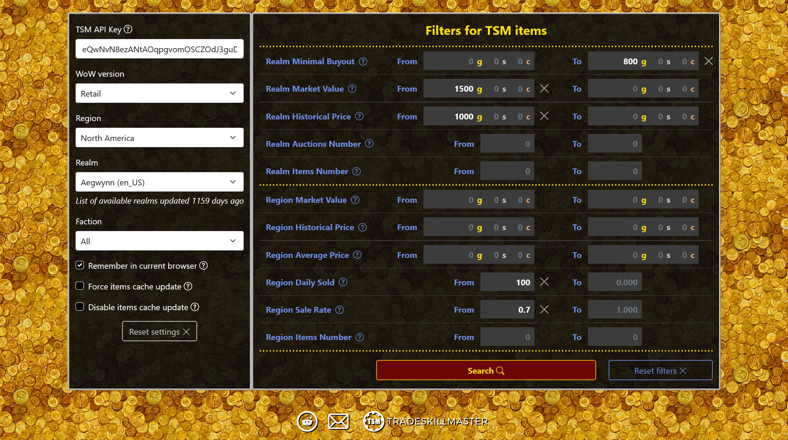
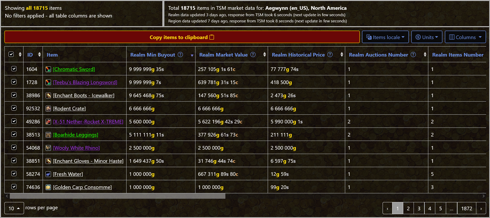

# tsm_data_filters

A compact Flask web tool that retrieves market data from an external API, normalizes it into a compact format, caches it on disk, and presents it through a filterable table in the browser.

## Overview

The tool takes a user-provided API token, authenticates against an external pricing API, downloads auction-house and region-level market snapshots for a selected realm, and renders the result as an interactive, filterable table. A user picks a game version, region, realm and faction, optionally adjusts numeric filters (min/max for prices, number of auctions, sale rate, etc.), and sees the matching items.

The concrete data source is the [TradeSkillMaster](https://tradeskillmaster.com) API, which exposes World of Warcraft auction-house statistics. From an engineering point of view, however, the project is a general-purpose pattern: OAuth2 token exchange, paginated data retrieval, light normalization, file-based caching with TTL, and a thin Flask front-end that drives a client-side table.

## Screenshots

Main page — realm selection on the left, filters on the right:



Search results — filtered table with per-item tooltips and a set of display controls: item-label locale (9 languages), money units (gold / silver / copper), column visibility and per-column sorting:



## Who this is for

Market-data users, auction-house analysts, crafters and players comparing item profitability who want quick, filterable views over current and historical pricing without wiring up a spreadsheet every time. The TSM web site has its own data tables, but they are single-realm-at-a-time and don't let you filter by combined metrics; this tool fills that gap. You need a TSM subscription (the API is gated behind it) and your own API token.

## My role

Solo developer. I wrote the backend (Flask app, API client, auth flow, cache layer, realms updater cron), the HTML/Jinja templates, the client-side JavaScript (filtering, table rendering, locale switching, cookie-backed settings), and the configuration/deployment setup.

## Core features

- **External API authentication** — OAuth2 `api_token` grant against the TSM auth endpoint; short-lived access tokens are re-used via cookies until expiry.
- **Data retrieval** — separate calls for realm auction-house pricing and region-level pricing, plus a one-shot download of the realm/region catalog.
- **Compact normalization** — API responses are reduced to fixed-order arrays keyed by item id, which shrinks the payload and simplifies the client code.
- **File-based caching with TTL** — per-auction-house and per-region JSON caches with expiry controlled by config; user can force refresh or disable updates from the UI.
- **Realms updater** — standalone script (`update_realms_cron.py`) refreshes the realm list independently from request handling and writes a versioned JS cache file consumed by the browser.
- **Filtering UI** — Bootstrap + `bootstrap-table` front-end with numeric min/max filters across ~15 market metrics, sticky header, and per-row tooltips for item names in multiple locales.
- **Safe config handling** — all secrets and deploy-specific values live in a local, git-ignored YAML file; a committed `config.example.yml` documents the expected keys.

## Tech stack

- **Python / Flask** — application framework and request routing.
- **requests** — HTTP client for the TSM API.
- **PyYAML** — configuration loader.
- **Flask-Minify** — HTML / JS / CSS minification on response.
- **Bootstrap 5 + bootstrap-table** — client-side table, filters, layout.
- **jQuery, js-cookie** — small client-side glue.

## Architecture

```
main.py                 Flask app; routes "/" (render UI) and "/tsm_data" (JSON endpoint)
tsm.py                  TSM API client: auth, realm/region catalog, AH/region pricing, cache I/O
update_realms_cron.py   Periodic realm catalog refresher; writes static/cache/realms<ts>.js
update_realms_cron.sh   Thin shell wrapper invoked by cron on the host
templates/              Jinja templates (base layout + main form)
static/js/scripts.js    Client-side filtering, table rendering, cookie persistence
static/css/, img/, icons/
config.yml              Local, git-ignored configuration (see config.example.yml)
```

Request flow in short: a browser POSTs the user's API key and realm selection to `/tsm_data`; the Flask handler exchanges the token for an access token (reusing a cached one if still valid), pulls region and AH pricing either from the filesystem cache or from the TSM API, and returns both payloads as JSON. The client-side script merges them into a single table and applies filters in-browser.

See [docs/ARCHITECTURE.md](docs/ARCHITECTURE.md) for a more detailed walkthrough.

## How to run locally

```sh
# 1. Create a TSM API token at https://tradeskillmaster.com (under "My Account")
#    and obtain a TSM OAuth client_id for the api_token grant.

# 2. Copy the example config and fill in your values.
cp config.example.yml config.yml
$EDITOR config.yml

# 3. Install dependencies in a virtualenv.
python -m venv venv
. venv/bin/activate
pip install -r requirements.txt

# 4. Seed the realms catalog (used by the browser for the realm dropdown).
python update_realms_cron.py

# 5. Run the Flask dev server.
python main.py
# Then open http://127.0.0.1:5000/
```

In production the app is served through a WSGI stack (e.g. Passenger / gunicorn) and `update_realms_cron.sh` is invoked on a schedule with `APP_DIR` pointing at the deployment directory.

## Status

Personal side project from 2023. Not actively maintained — the code is kept as a working snapshot that documents the design, not as a continuously updated service. Dependencies are pinned to versions that worked at the time of the last release and are not being refreshed.

> **Note:** This is a cleaned source snapshot. Sensitive runtime configuration has been replaced with example files.
